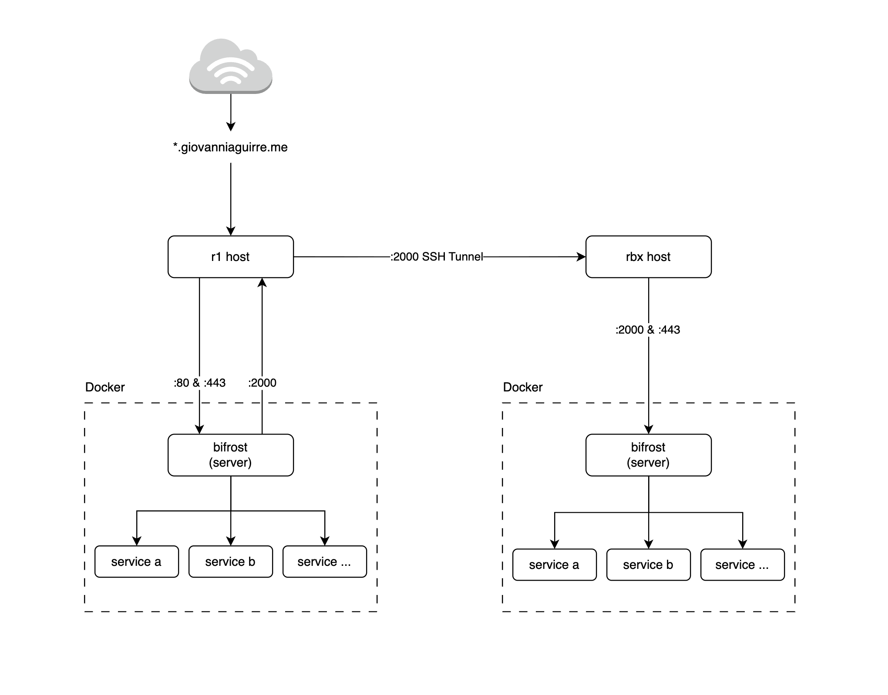

# Networking



# Setup SSH tunnel

Communicaton between **r1** and **rbx** hosts happens through a SSH tunnel

### Setup on r1

Allow connections on port :2000 for incoming traffic from *bifrost*, but deny connections from other places (i.e. internet)

```shell
# Figure out docker network interface for bifrost.
# Look for the interface that matches bifrost's network (r1services)
# See how 'inet' shows the network address
#   5: br-cd9a6e555f0a: <BROADCAST,MULTICAST,UP,LOWER_UP> mtu 1500
#      qdisc noqueue state UP group default
#      link/ether 02:42:78:9b:2d:97 brd ff:ff:ff:ff:ff:ff
#      inet 172.20.2.1/24 brd 172.20.2.255 scope global br-cd9a6e555f0a
ip a

# Now, allow connections incoming on such interface
sudo ufw allow in on br-cd9a6e555f0a to any port 2000
```

Allow connections from such interface on the firewall

### Setup on rbx

*rbx* needs to open the ssh tunel between both hosts, via following command:

```shell
ssh -N -R 0.0.0.0:2000:localhost:2000 rock@143.244.144.17
```

Use the provided [systemd service] to open this tunel automatically during boot time

```shell
# Make sure autossh is available
sudo apt-get install autossh

# Symlink .service file to systemd
sudo ln -s $(pwd)/rbx/systemd/r1-ssh-tunnel.service /etc/systemd/system/r1-ssh-tunnel.service

# Start the service manually to verify it works
sudo systemctl start r1-ssh-tunnel.service

# Monitor its status and logs
sudo systemctl status r1-ssh-tunnel.service
sudo journalctl -u r1-ssh-tunnel.service

# Enable service file to start automatically
sudo systemctl enable r1-ssh-tunnel.service

# Now it will start automatically during boot
```

### Setup r1 web server

Now *r1* will route all incomming traffic at port `:2000` to *rbx* via the tunnel, hence, use *r1* as upstream for *r1's bifrost*.

Sample config to redirect `sample.giovanniaguirre.me`. Notice the `proxy_pass` config in `location` block

```cgi
server {
    # Listen to port 443 on both IPv4 and IPv6.
    listen 443 ssl;
    listen [::]:443 ssl;

    server_name fileb.giovanniaguirre.me;

    client_max_body_size 5120M;
    access_log /var/log/nginx/fileb.giovanniaguirre.me.access.log;
    error_log /var/log/nginx/fileb.giovanniaguirre.me.error.log;

    # Load the certificate files.
    ssl_certificate         /etc/letsencrypt/live/fileb/fullchain.pem;
    ssl_certificate_key     /etc/letsencrypt/live/fileb/privkey.pem;
    ssl_trusted_certificate /etc/letsencrypt/live/fileb/chain.pem;

    location / {
        proxy_set_header        Host $host;
        proxy_set_header        X-Real-IP $remote_addr;
        proxy_pass              https://172.20.2.1:2000;
        proxy_buffering         off;
        proxy_request_buffering off;

	      # Websockets support
    	  proxy_http_version 1.1;
      	proxy_set_header Upgrade $http_upgrade;
      	proxy_set_header Connection "upgrade";

        # proxy_ssl_verify        on;
        # proxy_ssl_verify_depth  2;
        proxy_ssl_session_reuse on;
    }
}
```

